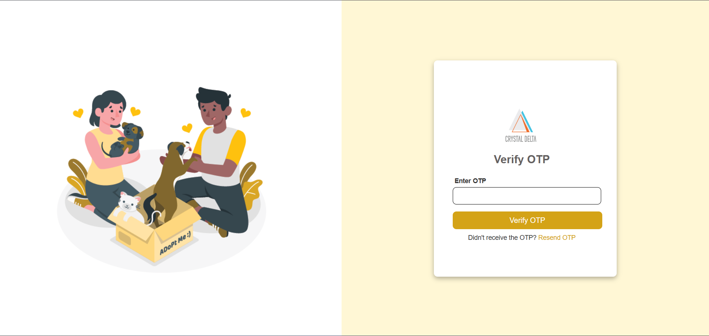
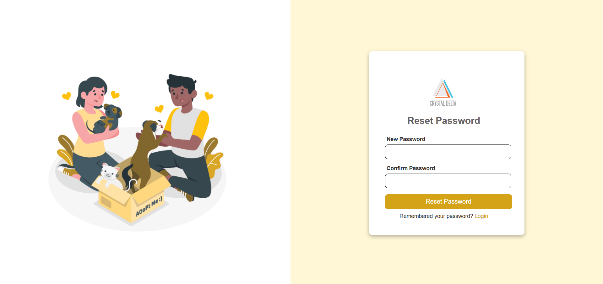
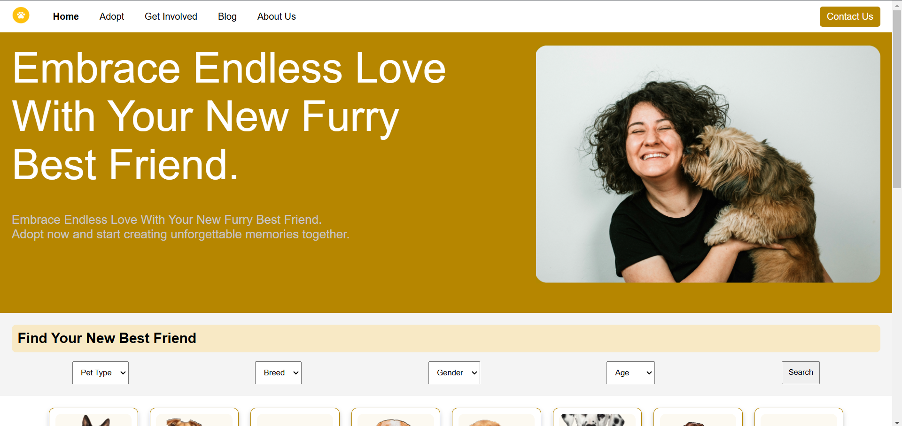
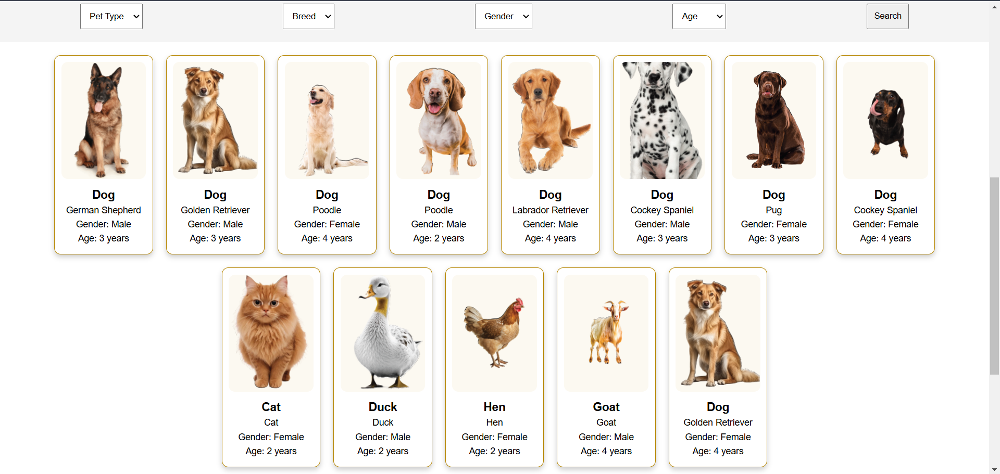
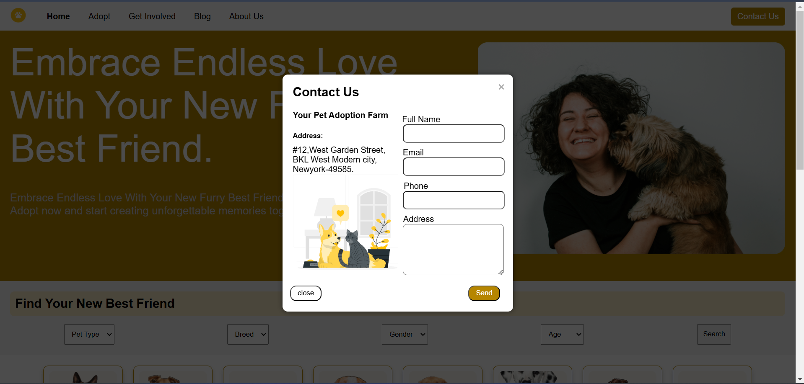
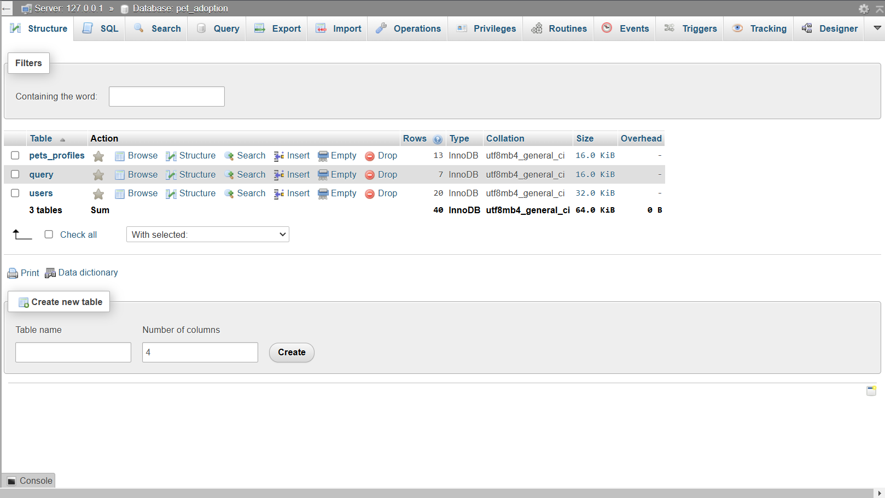

# Pet Adoption Project

## Overview
The Pet Adoption project is a web application designed to facilitate the adoption of pets through a secure, user-friendly interface. It allows users to register, log in, and manage their profiles while providing functionality for forgotten usernames or passwords. The project integrates a MySQL database to store user and pet information, with strong security measures such as password hashing. Additionally, email notifications are handled via the Brevo API for operations like password recovery and username retrieval.

---

## Features
- **User Authentication**: A secure login and registration system with validation and password hashing.
- **Forgot Password and Forgot Username**: Users can reset their passwords or retrieve their usernames via email.
- **Homepage**: Displays a list of pet profiles, including details such as name, breed, pet type, age, and gender.
- **Pet Adoption Pages**: Includes "Adopt," "Get Involved," "About," and "Blog" pages with static content.
- **Contact Page**: Allows users to submit queries, which are stored in a database.
- **Database**: The application stores user data, pet profiles, and contact queries in a MySQL database.

---

## Screenshots

### Login Page
  
*Description: A secure login page for users to access their accounts.*

### Registration Page
  
*Description: The user registration page with validation for secure account creation.*

### Forgot Password

#### Step 1: Enter Email Address  
  
*Description: The initial forgot password page where users enter their email.*

#### Step 2: OTP Verification  
  
*Description: The OTP verification page where users input the code sent to their email.*

#### Step 3: Set a New Password  
  
*Description: The page where users set a new password after successful verification.*

### Forgot Username
  
*Description: The forgot username page where users enter their registered email to retrieve their username.*

### Homepage

*Description: Homepage of the pet adoption website.*

*Description: The homepage displays a list of pet profiles with essential details such as name, breed, and age.*

### Contact Page
  
*Description: A contact form for users to submit queries to the admin.*

### Database Structure
  
*Description: A MySQL database structure showing the `users`, `pet_profiles`, and `query` tables.*

---

## Technologies Used
- **Frontend**: HTML, CSS, JavaScript
- **Backend**: PHP
- **Database**: MySQL (XAMPP)
- **Email Service**: Brevo API (formerly Sendinblue)

---

## Functionality Details

1. **User Authentication**:
   - Users can register with their details, which are validated before being stored.
   - Passwords are securely hashed using encryption.
   - Registered users can log in to access the pet adoption features.

2. **Forgot Password**:
   - Users can reset their password by providing their email.
   - An OTP is sent to the user's email via the Brevo API for verification.
   - After verifying the OTP, the user can set a new password.

3. **Forgot Username**:
   - Users who forget their username can request it to be sent to their email via the Brevo API.

4. **Pet Profiles**:
   - The homepage displays a list of pet profiles with essential information (name, breed, type, age, gender).
   - Pet profiles are stored in the `pet_profiles` table in the database.

5. **Contact Page**:
   - Users can submit queries, which are stored in the `query` table for further action.

6. **Static Pages**:
   - The project includes the following static pages:
     - **About Page**: Information about the pet adoption process.
     - **Get Involved Page**: Details on how users can help with the adoption process.
     - **Adopt Page**: Information for potential pet adopters.
     - **Blog Page**: Pet adoption-related blog content.

---

## Database Structure
The project uses a MySQL database with the following tables:
- **Users Table**: Stores user information, including email, hashed passwords, and other details.
- **Pet Profiles Table**: Stores information about pets available for adoption (name, breed, type, age, gender, availability).
- **Query Table**: Stores user-submitted queries via the contact page.

---

## Installation and Setup

 ### Step 1: Clone the Repository
       git clone https://github.com/Siva-surendar/Pet-Adoption-Website.git

### Step 2: Setup XAMPP
1. Install XAMPP and start the **Apache** and **MySQL** services.
2. Import the provided MySQL database (`pet_adoption`) into **phpMyAdmin**.

### Step 3: Configure PHP Files
1. Edit the PHP files to configure your MySQL database connection:
   - Set the **DB host**, **username**, and **password** as per your setup.

### Step 4: Send Email with Brevo
1. Sign up for **Brevo** (formerly Sendinblue) and obtain an API key.
2. Configure the API key in the PHP files responsible for sending emails.

### Step 5: Run the Application
1. Place the project files in the `htdocs` folder of your XAMPP installation.
2. Access the project by navigating to: 
         http://localhost/pet_adoption

